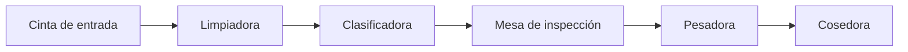

# Vegetable Line Simulator

API REST en ASP.NET Core que simula en tiempo real una línea de empaque de papas: limpieza, clasificación, inspección, pesaje y cosido de bolsas. Expone el estado de la línea, los KPIs de producción y las alarmas para que un dashboard los muestre en vivo.

**Demo:** https://vegetable-line-web.vercel.app (dashboard en Angular que consume esta API)

## Qué hace

Al arrancar, un servicio en segundo plano empieza a procesar lotes de papa. Cada segundo entran 50 kg a la línea y pasan por las estaciones en orden:



| Estación | Qué simula |
|---|---|
| Limpiadora | Saca entre 2 % y 5 % de tierra, según la calidad del lote |
| Clasificadora | Separa la papa en chica, mediana y grande (cerca de 20 / 60 / 20) |
| Mesa de inspección | Descarta entre 1 % y 4 % por defectos, según la calidad del lote |
| Pesadora | Arma bolsas de 25 kg con tolerancia de ±0,2 kg; un 5 % sale fuera de tolerancia |
| Cosedora | Cose las bolsas; un 3 % sale con falla de cosido |

Entre estación y estación hay cintas transportadoras, que también forman parte del modelo.

La demo trabaja con tres lotes de prueba. Dos traen problemas a propósito, para que se disparen alarmas:

| Orden | Productor | Variedad | Lote | Particularidad |
|---|---|---|---|---|
| 1 | Agro Los Teros (Balcarce) | Spunta | 6.000 kg | Lote normal |
| 2 | Hnos. Ferreyra (Villa Dolores) | Asterix | 9.000 kg | Mucha tierra |
| 3 | La Cosecha SRL (Tafí del Valle) | Donata | 12.000 kg | Muchas papas defectuosas |

Procesar los tres lleva unos 9 minutos. Al terminar, la simulación espera 30 segundos y vuelve a empezar.

## Alarmas

En cada tick se evalúan las condiciones de cada estación. Una alarma se crea cuando la condición se cumple y se normaliza sola cuando deja de cumplirse, así no se repite en cada tick.

| Alarma | Estación | Condición | Severidad |
|---|---|---|---|
| `HighSoil` | Limpiadora | Más de 6 % de tierra en el último minuto | Warning |
| `HighReject` | Mesa de inspección | Más de 5 % de descarte en el último minuto | Warning |
| `OutOfTolerance` | Pesadora | Más de 3 de las últimas 20 bolsas fuera de tolerancia | Warning |
| `LowThroughput` | Pesadora | Menos de 80 bolsas en el último minuto | Critical |
| `SewingFailures` | Cosedora | Más de 2 de las últimas 20 bolsas con falla de cosido | Warning |

Las alarmas que dependen de una tasa esperan a tener un minuto completo de datos, para no dar falsos positivos al inicio de una orden.

## Stack

- .NET 10 y ASP.NET Core (controllers)
- `BackgroundService` para el loop de simulación
- OpenAPI con `Microsoft.AspNetCore.OpenApi`
- Docker (build multi-stage)
- Sin base de datos: el estado vive en memoria

## Endpoints

| Método | Ruta | Devuelve |
|---|---|---|
| GET | `/api/line/status` | Estado de la línea y de cada estación, con su métrica principal |
| GET | `/api/orders/current` | Orden en curso: lote, avance y bolsas producidas |
| GET | `/api/orders` | Todas las órdenes con su estado |
| GET | `/api/kpis` | KPIs de la orden en curso y sus límites configurados |
| GET | `/api/alarms` | Alarmas, de la más reciente a la más vieja. Acepta `?active=true` o `?active=false` |
| POST | `/api/alarms/{id}/acknowledge` | Marca una alarma como reconocida |
| GET | `/api/charts/bags-per-minute` | Bolsas por minuto de los últimos 30 minutos |
| GET | `/api/charts/weight-distribution` | Histograma del peso de las bolsas de la orden en curso |
| GET | `/api/charts/grading` | Porcentaje de papa chica, mediana y grande |

Los endpoints que dependen de la orden en curso responden `204 No Content` cuando no hay ninguna. Los enums viajan como texto y los porcentajes van en escala 0–100.

Ejemplo de respuesta de `GET /api/kpis`:

```json
{
  "orderId": 2,
  "bagsPerMinute": 109.0,
  "outOfTolerancePercent": 4.85,
  "soilPercent": 6.31,
  "rejectPercent": 2.47,
  "yieldPercent": 91.2,
  "limits": {
    "minBagsPerMinute": 80,
    "maxOutOfTolerancePercent": 15,
    "maxSoilPercent": 6,
    "maxRejectPercent": 5
  }
}
```

## Cómo correrlo

### Con .NET

Requiere el SDK de .NET 10.

```bash
git clone https://github.com/SofiaCantalupi/vegetable-line-simulator.git
cd vegetable-line-simulator
dotnet run
```

La API queda en `http://localhost:5112`. Para probarla:

```bash
curl http://localhost:5112/api/line/status
```

El archivo [VegetableLine.http](VegetableLine.http) trae un pedido de ejemplo por endpoint, listo para ejecutar desde VS Code o Visual Studio. En entorno de desarrollo, la especificación OpenAPI está en `/openapi/v1.json`.

### Con Docker

```bash
docker build -t vegetable-line .
docker run -p 8080:8080 vegetable-line
```

La API queda en `http://localhost:8080`.

### CORS

Los orígenes permitidos se leen de `AllowedOrigins` en [appsettings.json](appsettings.json). Para agregar otro sin tocar el archivo, se puede usar una variable de entorno como `AllowedOrigins__2=https://mi-frontend.com`.

## Estructura

```
Controllers/          Endpoints de la API
Dtos/                 Contratos de respuesta, separados de los modelos
Models/               Dominio: estaciones, lotes, órdenes, bolsas y alarmas
  Enums/
Simulation/           Loop de simulación, monitor de alarmas, métricas y datos de prueba
SimulationSettings/   Parámetros de la simulación (tasas, tolerancias, umbrales)
Program.cs            Configuración de servicios, CORS y pipeline
```

## Decisiones de diseño

- **Cada estación procesa a su manera.** `Station` es una clase abstracta con un método `Process(kgIn, context)` que recibe los kilos que llegan y devuelve los que siguen. Cada estación lo implementa con su lógica y el simulador solo las recorre en orden, sin saber qué hace cada una. Agregar una estación nueva no obliga a tocar el loop.
- **Un único estado compartido, protegido con un lock.** `SimulationContext` es un singleton que guarda todo el estado. El simulador toma el lock durante cada tick y los controllers al leer, así ningún pedido ve datos a medio actualizar.
- **Ventanas deslizantes para tasas y alarmas.** Se guardan los ticks del último minuto para calcular bolsas por minuto, tierra y descarte recientes, en lugar de usar solo los acumulados de la orden.
- **DTOs separados de los modelos.** La API no expone las entidades del dominio: cada endpoint arma su respuesta con lo que el dashboard necesita.
- **Cálculos compartidos en un solo lugar.** `LineMetrics` concentra las fórmulas que usan varios endpoints, para que un mismo indicador no se calcule distinto en dos lados.

## Limitaciones y próximos pasos

- El estado está en memoria: se pierde cuando se reinicia la aplicación.
- Las paradas de estación y los pallets están modelados (`Stoppage`, `Pallet`), pero la simulación todavía no los usa.
- No hay tests automatizados. El primer candidato es `LineMetrics` y la lógica de `AlarmMonitor`.
- El dashboard consulta por polling. Una mejora posible es enviar los cambios con SignalR.
